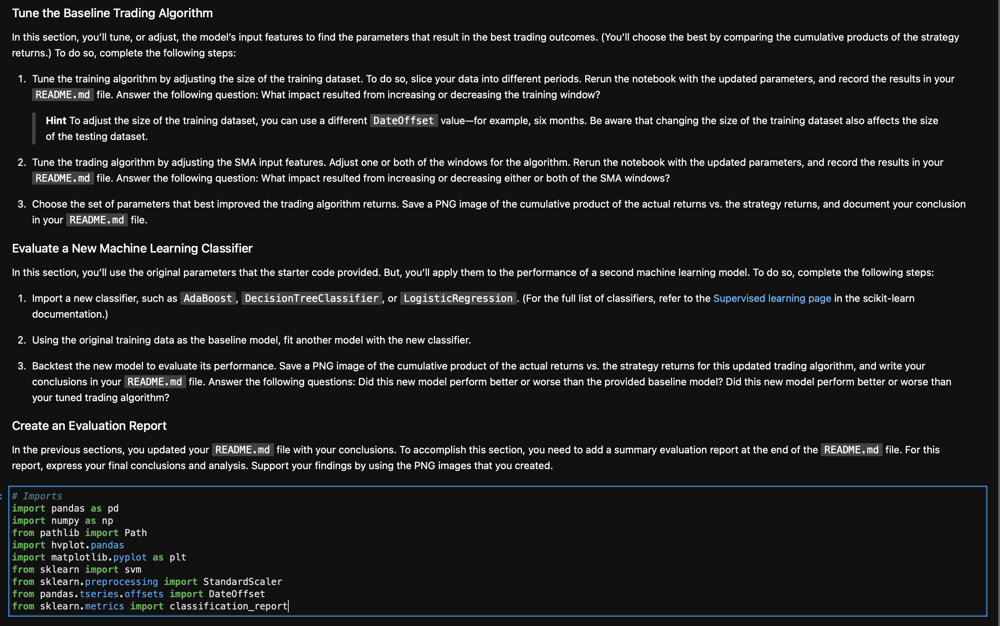
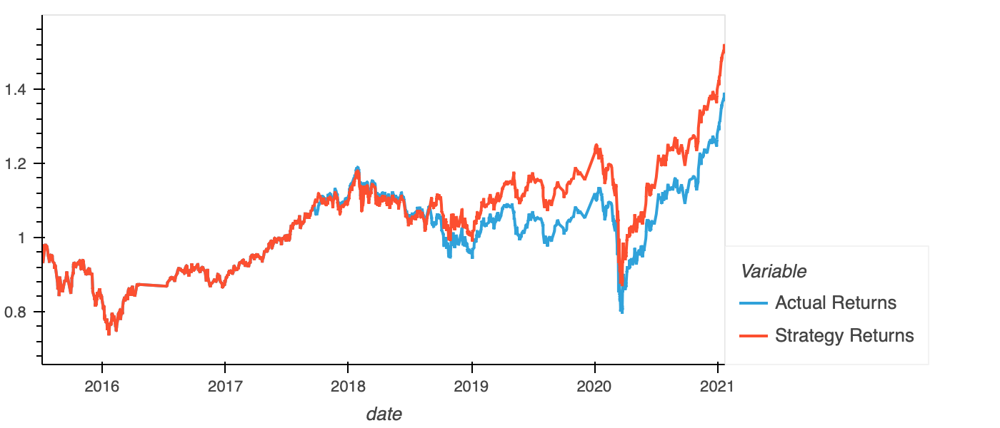
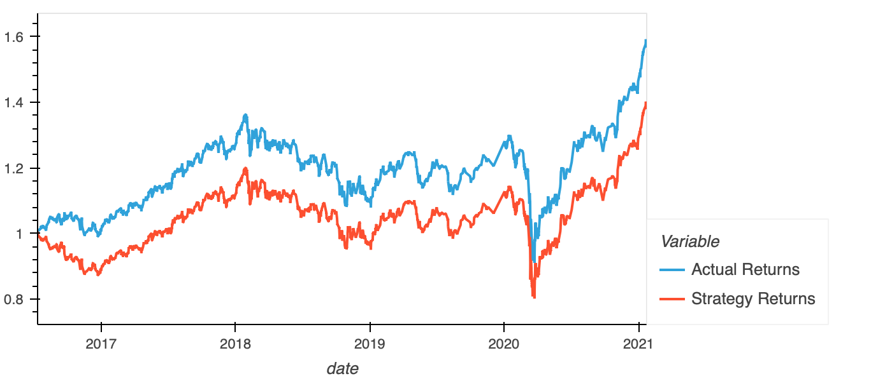
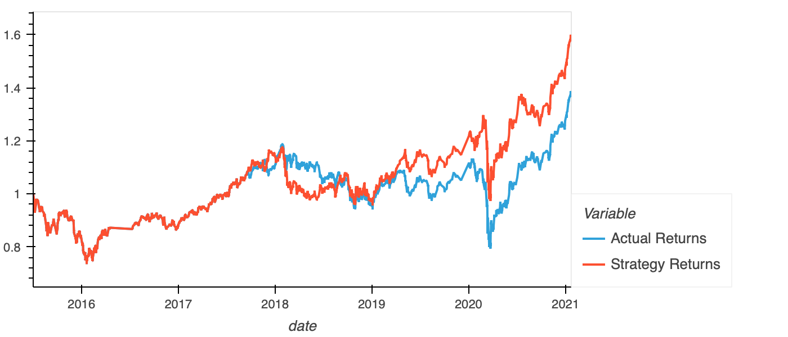

# Machine Learning Trading Bot / Module 14 Challenge
---

This is a code created with a Jupyter Lab Notebook used with the assitance of Pandas to use a deep learning model thats trained and tested in order to further analyze an automated trading Algorithm which sole purpose to to buy on bullish SMA (Simple Moving Average) crossovers to the upside between the years of 2015-2021. The objective was to find out the best use for certain models (classification) and editing the range of the moving averages in an attempt to imporove the cumulative returns over this time period.
## Technologies

This project uses python 3.7 with the following packages:

* [Pandas](https://github.com/pandas-dev/pandas) - Pandas is an open-source library that offers easy-to-use data analysis tools for Python.

* [Jupyter Lab](https://jupyter.org) - For an intuitive notebook IDE

* [scikit-learn](https://scikit-learn.org/stable/) - For sofisticated machine learning models

* [logistic-regression] (https://scikit-learn.org/stable/modules/generated/sklearn.linear_model.LogisticRegression.html) - Classifying Model


 
---

## Installation Guide

Before running the application first install the following:


* [Install] Anaconda with Python 3.7+(https://docs.anaconda.com/anaconda/install/)
You should always be in a conda dev environment when launching JupyterLab.


---

## Install/Import the following libraries and dependencies 

```python
# Install the required libraries
conda install -c conda-forge imbalanced-learn
conda install -c conda-forge pydotplus

# Imports
import pandas as pd
import numpy as np
from pathlib import Path
import hvplot.pandas
import matplotlib.pyplot as plt
from sklearn import svm
from sklearn.preprocessing import StandardScaler
from pandas.tseries.offsets import DateOffset
from sklearn.metrics import classification_report
```
---

## Usage

To view the venture_funding_with_deep_learning.ipynb, open file via Jupyter Lab

```conda activate dev
cd <location of (venture_funding_with_deep_learning.ipynb)>
jupyter lab
```

Upon launching the Jupyter Lab NOTEBOOK you will be greeted with the following prompts.




As Well as the following model/SM comparisons in an attempt to improve the strategies baseline performance 


 Baseline Performance

 length of the SHORT WINDOW (21) and LONG WINDOW (200), this made the strategy performace fall behind actual returns

 length of SMA SLOW reduced (3) and LONG WINDOW reduced (28), this improved the model's performance.


---

## Contributors

Brought to you by MartyCodes333 (martique.henton@gmail.com) with the help of 2021 UW FinTech Bootcamp Instructors, TA's and Fellow Classmates